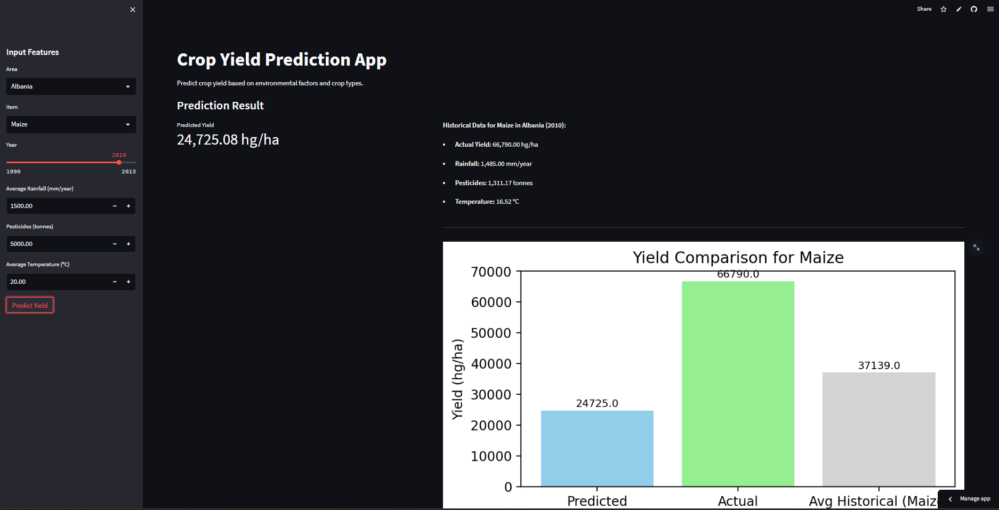
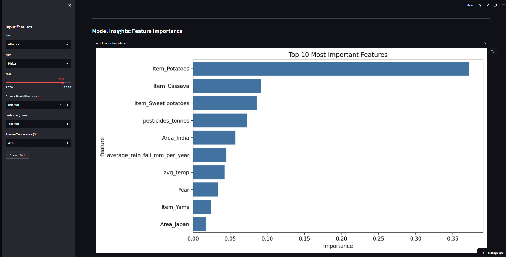
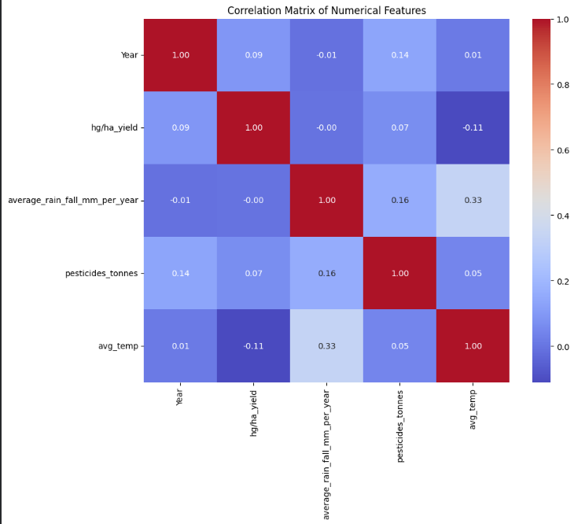
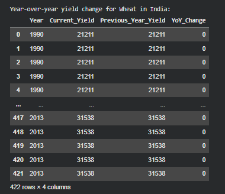
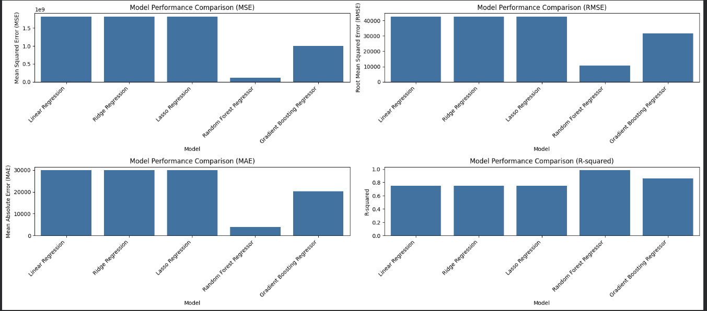
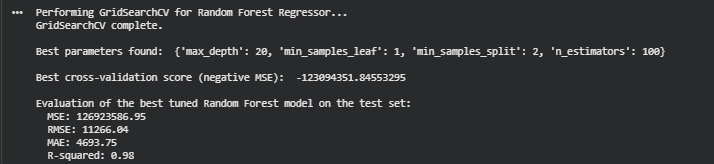
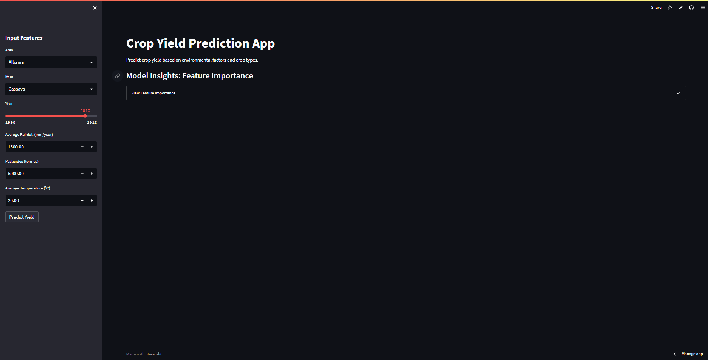

# ml-agriculture-insights
An investigation into the various environmental and management factors influencing crop yield.

## Deployed Machine Learning Web App for Crop Yield Prediction 
An end-to-end machine learning system that predicts agricultural crop yield using cross-validated model comparison and hyperparameter tuning. The final tuned Random Forest model is deployed via Streamlit for inference.

### Interactive Streamlit app for crop yield prediction using a trained Random Forest model:
### 

### Streamlit App

| Yield Prediction | Feature Importance |
|------------------|--------------------|
|  |  |

## What This Project Demonstrates

* Structured end-to-end ML workflow
* Exploratory Data Analysis (EDA)
* Multiple regression model comparison
* K-Fold cross-validation
* Hyperparameter tuning with GridSearchCV
* Model serialization for production
* Deployment using Streamlit

This project goes beyond notebook experimentation and delivers a deployed ML application.

## Exploratory Data Analysis

Initial data exploration was conducted to understand feature relationships and guide model development.

Key objectives:
* Examine yield distribution
* Identify correlations between environmental variables and yield
* Detect potential multicollinearity
* Inform model selection decisions

| Correlation Matrix | 
|--------------------|
|  | 

The correlation matrix highlights the strength and direction of relationships between predictors and crop yield, providing insight into feature influence before model training.

## SQL-Based Analytical Layer
To demonstrate structured data analysis beyond pandas operations, the dataset was loaded into an in-memory SQLite database.

The DataFrame was converted into a relational table (crop_yield_data) and queried using SQL to perform advanced analytical tasks.

### SQL Analyses Performed
* Null value validation across all columns
* Distinct counts for categorical variables
* Top 5 areas with highest average yield for Maize
* Year-over-year yield change for Wheat in India (using window functions with LAG)
* Average crop yield when average temperature exceeds 25°C

| Year over Year Wheat Change SQL | 
|---------------------------------|
|  | 

Example query:
SELECT
    Area,
    AVG("hg/ha_yield") AS Average_Yield
FROM crop_yield_data
WHERE Item = 'Maize'
GROUP BY Area
ORDER BY Average_Yield DESC
LIMIT 5;

## Model Development 

Models Evaluated
* Linear Regression
* Ridge Regression
* Lasso Regression
* Random Forest Regressor
* Gradient Boosting Regressor

| Model Evaluation | 
|--------------------|
|  | 

Each model was evaluated using cross-validation to ensure generalization performance.

## Final Model Selection
- Selected Model: Tuned Random Forest Regressor
- Optimization Method: GridSearchCV with K-Fold cross-validation

| Final Model | 
|-------------|
|  | 

### Evaluation Metrics
* R²: 0.98 
* RMSE: 11266.04 
* MAE: 4693.75

The selected model provided the best trade-off between bias and variance among evaluated algorithms.
Model artifacts were serialized using joblib to ensure reproducible inference in the deployed environment.

### Feature Importance Analysis 
Feature importance was extracted from the final Random Forest model to identify the most influential variables affecting crop yield.

| Feature Importance Chart | 
|--------------------------|
|  | 

This adds interpretability and allows domain insight into key agricultural drivers.

## Web Application

The trained model is deployed via Streamlit as an interactive prediction interface.

### User Workflow

#### User Input
→ Model Inference
→ Yield Prediction
→ Output Display

The application loads:

* best_rf_model_tuned.pkl
* training_columns.pkl
* Supporting preprocessing artifacts

| User Input | 
|------------|
|  | 

| Prediction Result Output | 
|--------------------------|
|  | 

## Deployment Architecture
The system architecture has a clean inference pipeline: 

User Interface (Streamlit)
→ Loaded Serialized Model
→ Prediction Engine
→ Real-Time Output

The trained model and required artifacts were serialized using joblib to ensure consistency between training and deployment environments.

Hosted on: Streamlit Cloud

## Project Structure 

.
├── YieldProductionInsights.ipynb

├── streamlit_app.py

├── requirements.txt

├── best_rf_model_tuned.pkl

├── training_columns.pkl

├── feature_importances.pkl

├── original_df_for_streamlit.pkl

├── per_crop_mean_yield.pkl

├── y_train_mean.pkl

├── y_train_std.pkl

├── yield_df.csv

## Run Locally 

### Clone the repository: 
- git clone https://github.com/rras1205/ml-agriculture-insights.git

### Navigate to the repository: 
- cd ml-agriculture-insights

### Run streamlit app
- python -m streamlit run streamlit_app.py

## Technologies Used

* Python
* pandas
* scikit-learn
* matplotlib
* seaborn
* Streamlit
* joblib

## Limitations

While the model demonstrates strong predictive performance, several important limitations should be considered.

### Data Scope & Representativeness
* Model performance depends entirely on the historical dataset used for training.
* If future agricultural practices, crop varieties, or environmental conditions differ significantly from the training distribution, prediction accuracy may decline.
* Regions or crop types that are underrepresented in the dataset may not generalize well.

### Feature Constraints
* The model relies on a limited set of structured inputs (e.g., rainfall, temperature, pesticide usage, year, area, crop type).
* Important variables such as soil composition, irrigation methods, disease outbreaks, extreme weather events, and socio-economic factors are not included.

### Extrapolation Risk
* The model is more reliable for interpolation within observed ranges than extrapolation to unseen extreme conditions.

Correlation vs. Causation
* The model captures statistical associations between features and yield.
* Feature importance reflects relative predictive contribution, not causal influence.
* Establishing true causal relationships would require controlled agronomic or experimental study.

Model Complexity & Interpretability
* The Random Forest algorithm provides strong predictive performance but operates as a relatively opaque model compared to linear regression - difficult to understand how it arrives at its predictions. 
* Feature importance offers directional insight but does not fully explain individual predictions.

Performance Interpretation & Overfitting Risk
* Although Random Forest reduces overfitting through ensembling and randomness, it can still overfit if trees are overly deep or if strong location/year signals dominate the dataset.
* Exceptionally high accuracy may reflect structured patterns within the dataset rather than guaranteed real-world robustness.

